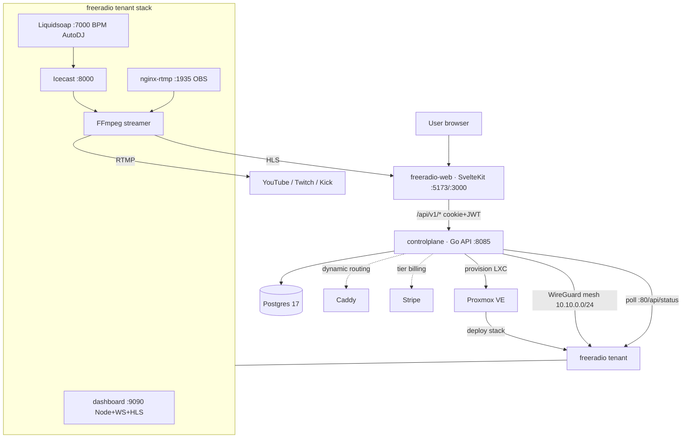

# Controlplane

[](https://github.com/Awis13/controlplane/actions/workflows/ci.yml)


[](LICENSE)

Multi-tenant control plane for managing LXC containers on Proxmox VE. Provides a REST API and admin dashboard for registering compute nodes, defining project templates, and provisioning isolated tenant instances with automatic networking, DNS routing, and billing.

Built with Go, PostgreSQL, and zero external ORMs.

## What this demonstrates

| Skill | Where it lives |
|-------|----------------|
| Async provisioning state machine with bounded concurrency | `internal/provisioner` — 10-slot semaphore, `provisioning -> active/error -> deleting -> deleted` |
| Hand-rolled Proxmox VE API client | `internal/proxmox` — LXC clone/start/stop/delete, node status, task polling (no SDK) |
| WireGuard mesh + Caddy dynamic routing orchestration | `internal/wireguard`, `internal/caddy` — live `wg0` sync, Admin API reverse-proxy routes |
| Passkey / WebAuthn authentication | `internal/admin` + `internal/auth` — WebAuthn admin, JWT + refresh tokens for users |
| Stripe tier enforcement | `internal/billing` — checkout, portal, webhooks, per-tier resource limits |
| PostgreSQL with golang-migrate, no ORM | `internal/database` — raw SQL via pgx, embedded SQL migrations |
| 355 standalone tests + CI | `*_test.go` (25 files), GitHub Actions (build, vet, gofmt, test) |

## STUDIO 23

Controlplane is the backend and brain of **STUDIO 23**, a multi-tenant streaming SaaS: one LXC container per tenant, each running a full per-tenant streaming stack, provisioned and wired together over a WireGuard mesh.

Sibling repositories:

- **[freeradio](https://github.com/Awis13/freeradio)** — the per-tenant streaming stack (Node dashboard, Icecast, Liquidsoap, FFmpeg, nginx-rtmp) that controlplane deploys into each tenant LXC. _(May be private for a few more hours while it is published in the same sweep.)_
- **[freeradio-web](https://github.com/Awis13/freeradio-web)** — the SvelteKit frontend users interact with, talking to controlplane over `/api/v1/*`.

### System interconnection



## Architecture

```
                                   +-----------------+
                                   |   Admin UI      |
                                   |  (WebAuthn +    |
                                   |   HTMX)         |
                                   +--------+--------+
                                            |
+---------------+    REST API     +---------v---------+     +------------+
|  SvelteKit    | -------------> |                     | --> | PostgreSQL |
|  Frontend     |   JWT / Bearer |    Controlplane     |    |    17      |
+---------------+                |       (Go)          |    +------------+
                                 |                     |
                                 +--+-----+------+----+
                                    |     |      |
                           +--------+  +--+--+  ++--------+
                           |           |     |            |
                    +------v---+ +----v--+ +-v--------+ +-v--------+
                    | Proxmox  | | Caddy | | WireGuard| |  Stripe  |
                    | VE API   | | Admin | |  wg0     | |  Billing |
                    +----------+ +-------+ +----------+ +----------+
                           |
                    +------v--------+
                    |  LXC Containers |
                    |  (tenants)      |
                    +-----------------+
```

## Features

- **Multi-tenant provisioning** -- async LXC container lifecycle with bounded concurrency (10 parallel jobs) and state machine (provisioning -> active/error -> deleting -> deleted)
- **Proxmox VE integration** -- custom API client for container clone, start, stop, delete, node status, and task polling
- **Admin dashboard** -- WebAuthn/passkey authentication, HTMX-powered UI for managing nodes, projects, tenants, audit logs, and settings
- **User self-service** -- JWT auth with refresh tokens, user-facing tenant CRUD with automatic node selection and SSO token generation
- **Dynamic DNS routing** -- Caddy Admin API integration for automatic `{subdomain}.{domain}` reverse proxy routes with startup reconciliation
- **WireGuard mesh** -- optional peer management with key generation, QR codes, config export, and live `wg0` synchronization
- **Stripe billing** -- subscription management with checkout sessions, customer portal, webhook processing, and tier enforcement
- **Audit logging** -- fire-and-forget database inserts for all CRUD operations
- **Security hardened** -- CSRF protection, CSP strict, HSTS, rate limiting, constant-time token comparison, AES-256-GCM encryption, 1MB body limit, Slowloris protection

## Tech Stack

| Component | Technology |
|-----------|------------|
| Language | Go 1.25 |
| HTTP Router | [chi/v5](https://github.com/go-chi/chi) |
| Database | PostgreSQL 17 (pgx, raw SQL, no ORM) |
| Migrations | [golang-migrate](https://github.com/golang-migrate/migrate) (embedded SQL) |
| Auth (Admin) | [WebAuthn/Passkeys](https://github.com/go-webauthn/webauthn) |
| Auth (Users) | JWT (HMAC-SHA256) with refresh tokens |
| Auth (API) | Bearer token (constant-time compare) |
| Encryption | AES-256-GCM |
| Rate Limiting | [httprate](https://github.com/go-chi/httprate) (IP-based) |
| CSRF | [nosurf](https://github.com/justinas/nosurf) |
| Billing | [Stripe](https://github.com/stripe/stripe-go) |
| VPN | WireGuard (wgctrl) |
| Logging | `log/slog` (structured JSON) |
| Container | Docker multi-stage (Alpine 3.21) |

## Quick Start

```bash
# Clone the repo
git clone https://github.com/yourusername/controlplane.git
cd controlplane

# Configure environment
cp .env.example .env
# Edit .env with your values (see Configuration below)

# Start services
docker compose up -d

# The API starts on :8080 with automatic database migrations.
# Set SETUP_TOKEN in .env for initial WebAuthn passkey registration.
```

## Configuration

All configuration is via environment variables. See [`.env.example`](.env.example) for the full list.

### Required

| Variable | Description |
|----------|-------------|
| `API_TOKEN` | Bearer token for API authentication |
| `ENCRYPTION_KEY` | 64-char hex key for AES-256-GCM encryption |
| `JWT_SECRET` | 64-char hex key for HMAC-SHA256 JWT signing |
| `POSTGRES_PASSWORD` | PostgreSQL password |

### Optional

| Variable | Default | Description |
|----------|---------|-------------|
| `BIND_ADDR` | `127.0.0.1` | Listen address |
| `HOST_PORT` | `8080` | Listen port |
| `SETUP_TOKEN` | -- | Required for first WebAuthn registration |
| `REGISTRATION_TOKEN` | -- | If set, user registration requires this token |
| `CORS_ORIGINS` | `localhost:5173,5174` | Comma-separated allowed origins |
| `WG_HUB_PUBLIC_KEY` | -- | Enables WireGuard module |
| `CADDY_ADMIN_URL` | -- | Enables dynamic DNS routing |
| `STRIPE_SECRET_KEY` | -- | Enables Stripe billing |

## API Endpoints

### Public

```
GET  /healthz                              Health check (DB ping)
```

### User Auth (JWT)

```
POST /api/v1/auth/register                 Register (requires REGISTRATION_TOKEN if set)
POST /api/v1/auth/login                    Login (returns JWT + refresh token)
POST /api/v1/auth/refresh                  Refresh JWT
GET  /api/v1/auth/me                       Current user profile
POST /api/v1/auth/logout                   Revoke refresh token
POST /api/v1/auth/password                 Change password
```

### User Tenants (JWT)

```
GET    /api/v1/user/tenants                List own tenants
POST   /api/v1/user/tenants                Create tenant (auto-selects node + project)
GET    /api/v1/user/tenants/{id}           Get tenant
DELETE /api/v1/user/tenants/{id}           Delete tenant
POST   /api/v1/user/tenants/{id}/suspend   Suspend tenant
POST   /api/v1/user/tenants/{id}/resume    Resume tenant
POST   /api/v1/user/tenants/{id}/sso-token Generate SSO token for dashboard access
```

### Admin API (Bearer Token)

```
GET    /api/v1/nodes                       List compute nodes
POST   /api/v1/nodes                       Register a Proxmox node
GET    /api/v1/nodes/{id}                  Get node details
PUT    /api/v1/nodes/{id}                  Update node
DELETE /api/v1/nodes/{id}                  Remove node

GET    /api/v1/projects                    List project templates
POST   /api/v1/projects                    Create project template
GET    /api/v1/projects/{id}               Get project
PUT    /api/v1/projects/{id}               Update project
DELETE /api/v1/projects/{id}               Delete project

GET    /api/v1/tenants                     List all tenants
POST   /api/v1/tenants                     Provision tenant (async, returns 202)
GET    /api/v1/tenants/{id}                Get tenant
PUT    /api/v1/tenants/{id}                Update tenant
DELETE /api/v1/tenants/{id}                Deprovision tenant
POST   /api/v1/tenants/{id}/suspend        Suspend tenant (stop LXC)
POST   /api/v1/tenants/{id}/resume         Resume tenant (start LXC)
```

### WireGuard (Bearer Token, optional)

```
GET    /api/v1/wireguard/peers             List peers
POST   /api/v1/wireguard/peers             Create peer
GET    /api/v1/wireguard/peers/{id}        Get peer
PUT    /api/v1/wireguard/peers/{id}        Update peer
DELETE /api/v1/wireguard/peers/{id}        Delete peer
POST   /api/v1/wireguard/peers/{id}/enable  Enable peer
POST   /api/v1/wireguard/peers/{id}/disable Disable peer
GET    /api/v1/wireguard/peers/{id}/config  Download WireGuard config
GET    /api/v1/wireguard/peers/{id}/qr      QR code for mobile setup
```

### Billing (JWT, optional)

```
POST /api/v1/billing/checkout              Create Stripe checkout session
POST /api/v1/billing/portal                Create Stripe customer portal
GET  /api/v1/billing/status                Get billing status
POST /api/v1/stripe/webhook                Stripe webhook (signature verified)
```

### Admin Dashboard (WebAuthn)

```
GET  /admin/                               Dashboard overview
     /admin/nodes                          Node management
     /admin/projects                       Project templates
     /admin/tenants                        Tenant management
     /admin/audit                          Audit log viewer
     /admin/settings                       System settings
     /admin/network                        WireGuard peers (if enabled)
```

## Project Structure

```
controlplane/
  cmd/server/main.go              Entry point, config, DB, graceful shutdown
  internal/
    config/                       Environment-based configuration
    database/                     PostgreSQL pool + embedded SQL migrations (16 files)
    server/                       chi router, middleware, security headers
    response/                     JSON helpers, pagination
    node/                         Compute node CRUD + Proxmox client cache
    project/                      Project template CRUD
    tenant/                       Tenant CRUD, user handler, state machine
    provisioner/                  Async LXC provisioning (bounded concurrency)
    proxmox/                      Proxmox VE API client (LXC lifecycle, tasks)
    sshexec/                      SSH exec for in-container operations
    station/                      Streaming station management + status poller
    crypto/                       AES-256-GCM encryption
    health/                       Health check with DB ping
    admin/                        WebAuthn dashboard (HTMX + Alpine.js)
    audit/                        Fire-and-forget audit logging
    auth/                         JWT auth, middleware, token store
    user/                         User accounts
    wireguard/                    WireGuard peer management
    billing/                      Stripe integration
    caddy/                        Dynamic reverse proxy routing
  docker-compose.yml              PostgreSQL + controlplane
  Dockerfile                      Multi-stage build (Go 1.25 -> Alpine 3.21)
```

## Key Design Decisions

- **No ORM** -- raw SQL via pgx for full control over queries and migrations
- **Async provisioning** -- tenant creation returns 202 immediately; a background worker handles the Proxmox API calls with a 10-slot semaphore
- **State machine at SQL level** -- `WHERE status = $expected` for compare-and-swap safety, no TOCTOU races
- **Atomic RAM reservation** -- `allocated_ram_mb + N <= total_ram_mb` enforced in SQL
- **Graceful shutdown** -- SIGTERM triggers provisioner drain (10s timeout), then HTTP shutdown
- **Modular integrations** -- WireGuard, Caddy, and Stripe are opt-in via environment variables; the system runs without them

## Running Tests

```bash
go test ./...
```

## License

MIT
